# smart-language

  <h1>🚀 智多语 (Smart Polyglot)</h1>
  <h3>基于讯飞人工智能平台的情景化多语言学习系统（人工智能技术+语言学习）</h3>

  

    
    
    
    
    
    系统演示视频链接：https://www.bilibili.com/video/BV1m68d67EAT/
  

---

## 📖 项目背景 (Project Background)

在传统的语言学习中，学生往往面临着**死记硬背、缺乏语境、难以开口**的痛点。随着全球化交流的需求增加以及人工智能技术的爆发，我们思考如何利用大模型的能力重塑语言学习体验。

**“智多语”** 因此应运而生。本项目不同于传统的单词卡片应用，它利用 **讯飞星火大模型** 的强大推理与生成能力，构建了一个**“情景化 + 沉浸式 + 个性化”**的自主学习平台。

我们致力于解决以下问题：
*   **缺乏语境**：通过 AI 生成特定情景（如商务、旅游、日常），在情景中学习单词和对话。
*   **交互单一**：支持**语音、文本、图片**（OCR）的多模态输入，模拟真实交流环境。
*   **反馈滞后**：利用 NLP 技术实现实时的作文批改和口语纠正。

---

## 🌟 核心功能 (Key Features)

本项目主要服务于学生、教师及家长三端，核心功能模块包括：

*   **🗺️ 入学引导 & 基础学习**：针对不同基础的用户（零基础/进阶），定制个性化的学习路径，包含音标、发音规则及母语对比。
*   **📕 情景化单词本**：打破传统词库限制，用户可自定义或选择场景（如“在咖啡馆”），AI 实时生成该场景下的核心词汇，实现**定量学、情景记**。
*   **💬 AI 情景模拟对话**：基于 **Netty + WebSocket** 实现的长连接对话系统。用户设定 AI 角色，进行语音/文本的实时多轮对话练习。
*   **📷 智能翻译 (多模态)**：集成讯飞接口，支持**语音翻译、文本翻译、图片(OCR)翻译**，满足多场景下的翻译需求。
*   **✍️ 智能作文批改**：支持手写作文拍照上传，AI 进行 OCR 识别后，从语法、结构、内容等多维度打分并提供修改建议。
*   **📖 智能阅读**：根据用户设定的难度、字数和主题，AI 自动生成阅读文章并高亮重点词汇。

---

## 🛠️ 技术架构 (Technical Architecture)

本项目采用**前后端分离**架构，以 Spring Boot 为核心，结合 Netty 处理高并发实时通讯，前端采用 React 构建响应式界面。

### 💻 技术栈 (Tech Stack)

| 类别 | 技术组件 | 说明 |
| :--- | :--- | :--- |
| **后端** | **Spring Boot 3.0.5** | 核心业务逻辑框架 |
| | **Netty** | 高性能 NIO 框架，处理 WebSocket 长连接 (AI 对话流) |
| | **MyBatis-Plus** | 数据持久层框架，简化 SQL 操作 |
| | **MySQL 8.1.0** | 关系型数据库，存储用户信息、情景数据等 |
| **前端** | **React** | 构建用户友好的 SPA (单页应用) |
| | **Axios / WebSocket** | HTTP 请求与实时双向通信 |
| **AI 能力** | **讯飞开放平台 API** | 语音合成/识别、机器翻译、OCR、星火大模型 |

### 📐 架构设计图

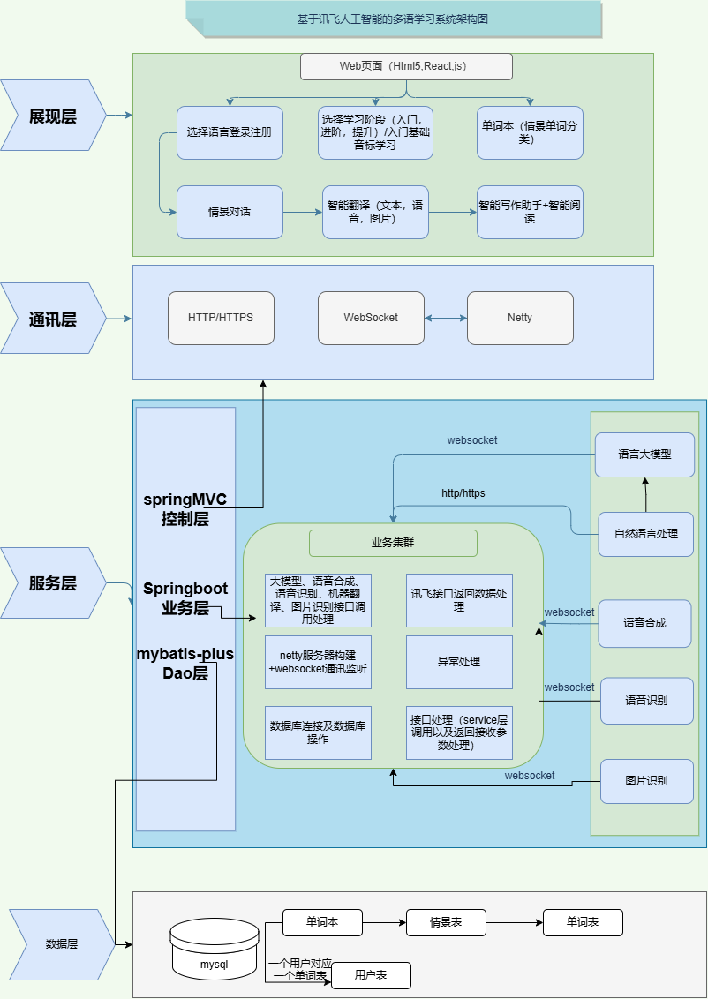

> **技术亮点：**
> *   使用 **Netty** 结合 WebSocket 协议，解决了 AI 对话场景下高频、实时的双向通信需求，相比传统轮询大大降低了服务器压力。
> *   严格遵循 **RESTful** 接口规范，实现了优雅的全局异常处理和参数校验。
> *   设计了复杂的数据库关系（用户-单词本-情景-单词），支撑个性化的数据存储。

---

## 📸 效果演示 (Screenshots)

### 1. 入学引导与学习主页
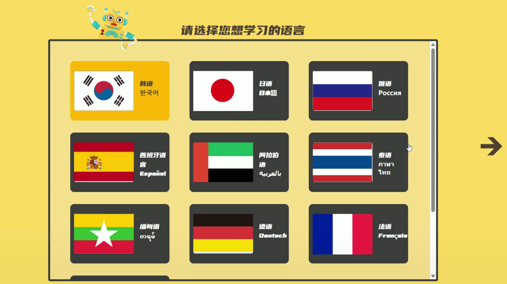
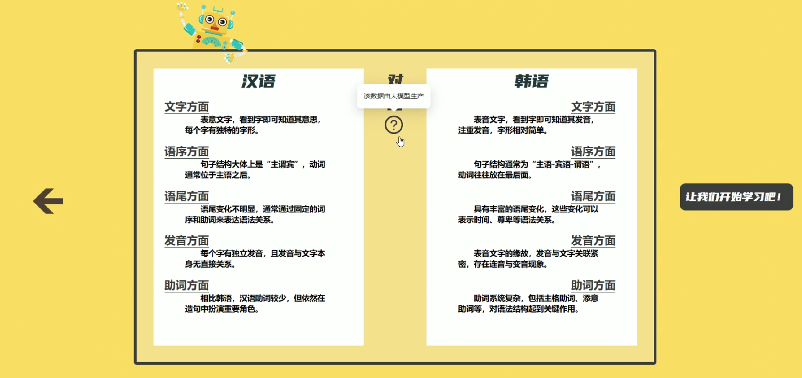
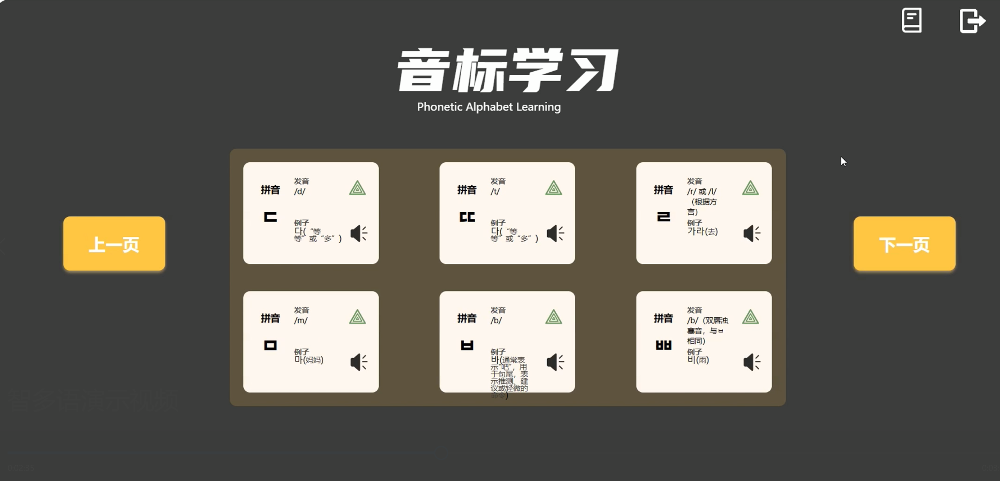
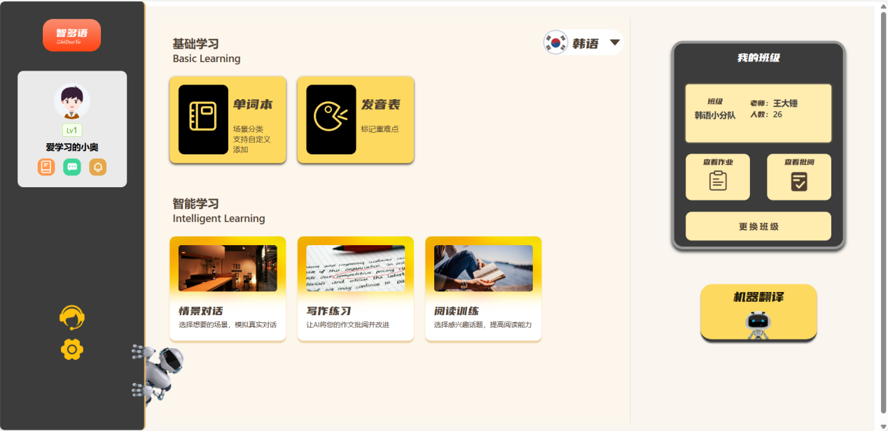

### 2. 情景化单词学习
*(用户选择情景并学习单词)*
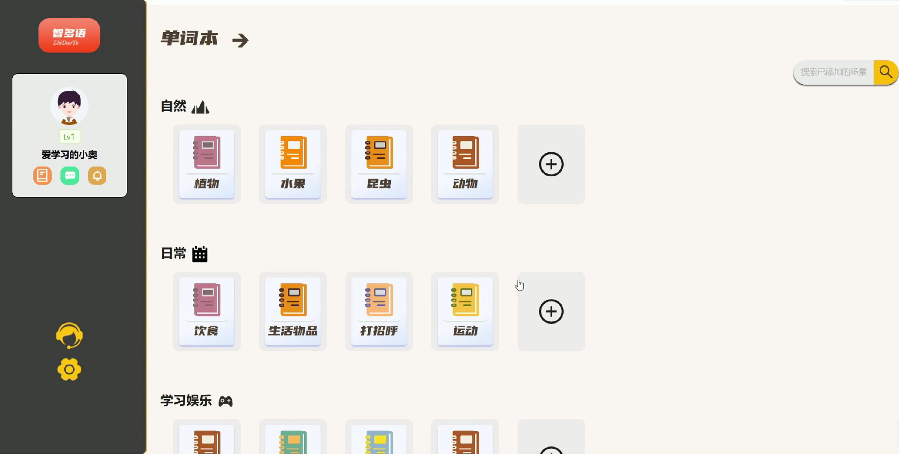
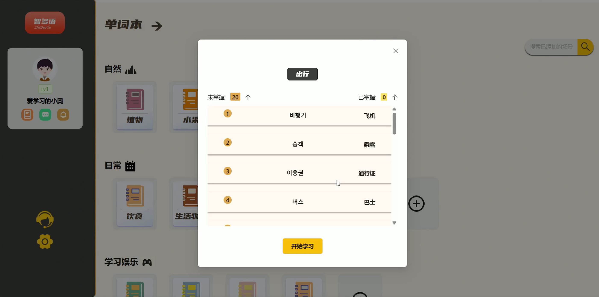
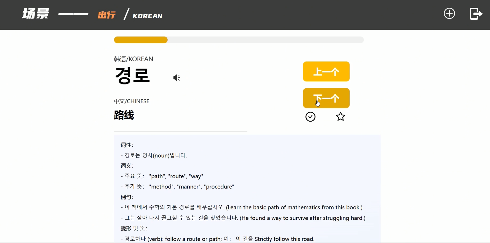

### 3. AI 模拟对话 (实时交互)
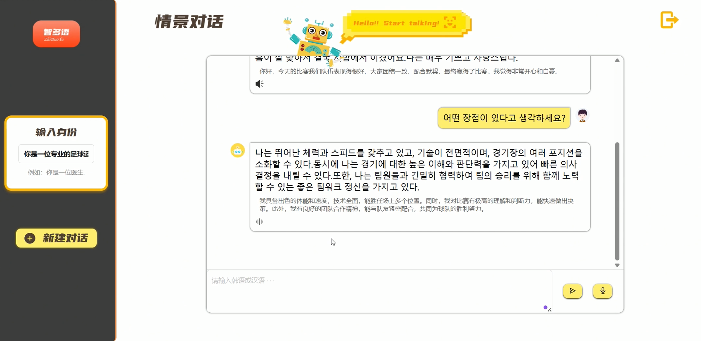
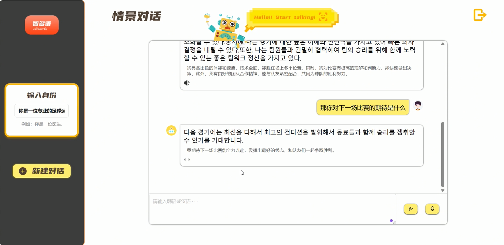

### 4. 智能作文批改 & 翻译
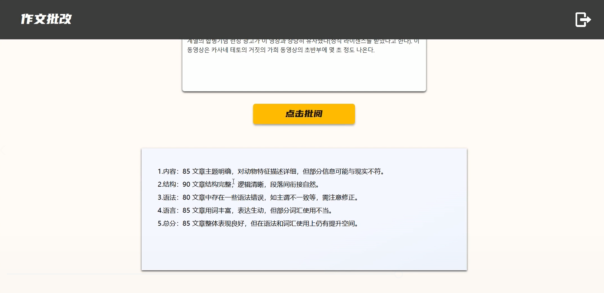
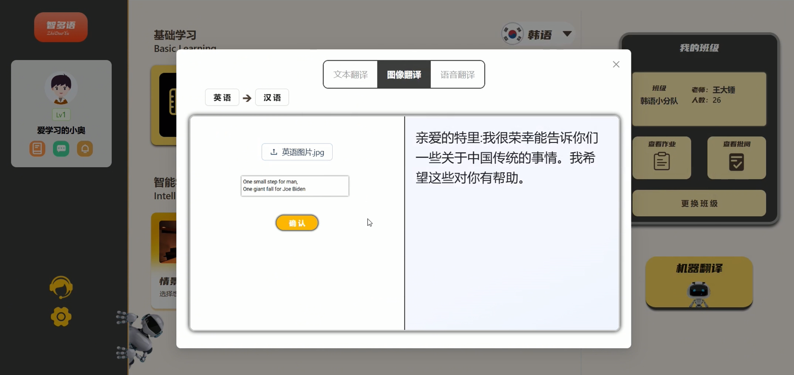

---

## 🚀 快速开始 (How to Run)

### 后端启动 (Backend)
1.  克隆仓库：`git clone [repository_url]`
2.  配置数据库：在 MySQL 中执行 `sql/init.sql` 脚本。
3.  配置 API Key：在 `application.yml` 中填入你的讯飞开放平台 AppID 和 Secret。
4.  运行 `Application.java` 启动 Spring Boot 服务。

### 前端启动 (Frontend)
1.  进入前端目录：`cd frontend`
2.  安装依赖：`npm install`
3.  启动项目：`npm start`

---

## 💡 项目亮点与创新 (Highlights)

1.  **情景化驱动 (Scenario-Based)**：区别于市面上的词汇书模式，我们实现了“所学即所用”，通过 AI 动态生成场景词汇，让学习更有目的性。
2.  **技术整合能力**：成功整合了语音识别、合成、OCR、大模型等多种 AI 能力，并解决了多模态数据（音频、图片、文本）在前后端的高效传输与处理。
3.  **高并发设计**：引入 Netty 框架处理即时通讯，为未来扩展多人在线课堂或大规模并发请求打下基础。
4.  **支持小语种**：架构设计天然支持多语言扩展，不仅限于英语，通过大模型能力可快速适配法语、德语等小语种。

---

## 📧 联系我 (Contact)

如果你对这个项目感兴趣，或者有任何技术问题想要交流，欢迎联系我！

*   **Email**: [3356253976@qq.com]
---

